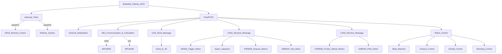

 

# Purdue Robomaster Infantry 2022
- Written using STM32 HAL Library and CubeMX.
- Main Control Board: DJI Robomaster Board A(STM32F427IIH6)

## Basic Components Include:
- 4 * M3508 Motors for Chassis
- 2 * M3508 Motors for Friction Wheels
- 2 * GM6020 Motors for Gimbal (Yaw & Pitch)
- 1 * M2006 Motor for Trigger
- 1 * Super Capacitor for Temporary Power Overload

## Current Function & Future Improvements
- Communications
  - [x] DR16 Remote Control
  - [x] Board A IMU
  - [x] MPU6050 IMU
  - [x] Motors
  - [x] Super Capacitor
  - [ ] Referee System

- Basic Controls
  - [x] Chassis (Forward/Backward, Leftward/Rightward, Rotate)
  - [x] Gimbal (Yaw, Pitch)
  - [x] Shooting (Friction Wheel On/Off, Single Shot, Burst)
  
- Advance Controls
  - [x] Follow Gimbal Mode (Chassis Follow Gimbal)
  - [x] Not Follow Gimbal Mode (Chassis Not Follow Gimbal)
  - [x] SpinTop Mode (Gimbal Holds in Position while Chassis Spins)
  - [ ] Power Limiting (Requires Referee System Communication)
  - [ ] Shooter Heat Regulation (Requires Referee System Communication)
  - [ ] Level Up Adjustments (Requires Referee System Communication)

## System Flow Chart

